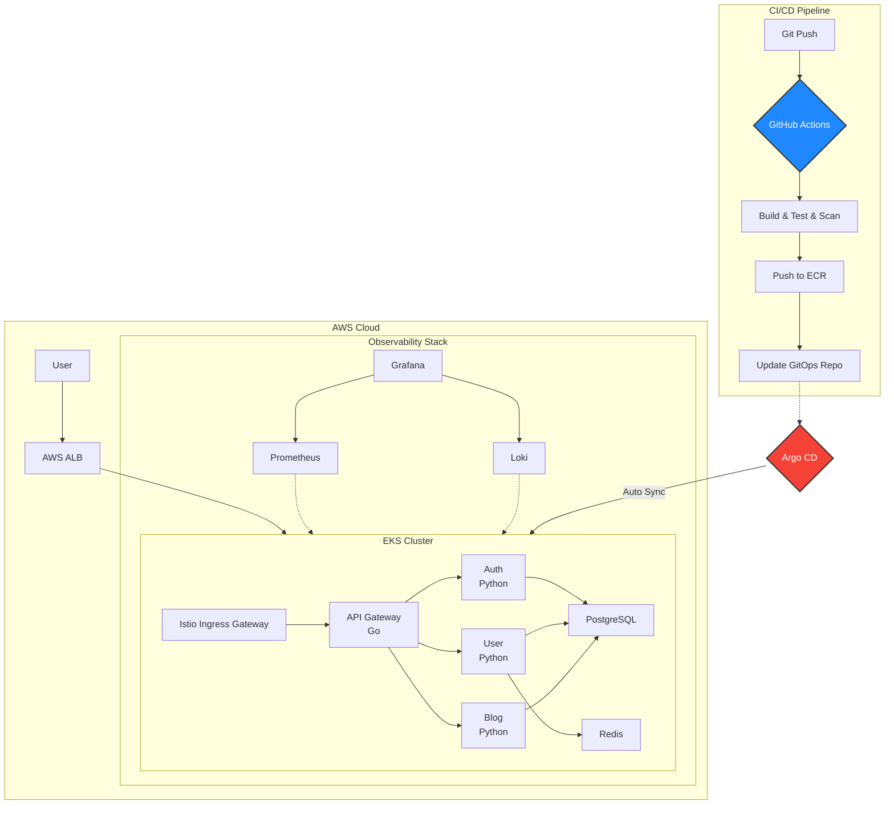

# Cloud-Native 마이크로서비스 플랫폼 v2.0

## (사진 첨부)

로컬 환경에서 운영되던 마이크로서비스 블로그 플랫폼(v1.0)을 AWS EKS 기반의 프로덕션급 클라우드 네이티브 아키텍처로 재구축한 프로젝트입니다. Terraform을 이용한 인프라 자동화(IaC), GitOps 기반의 CI/CD 파이프라인, 그리고 Istio 서비스 메시를 통한 관측 가능성과 보안 강화를 목표로 합니다.

---

## 주요 기능

-   **Infrastructure as Code**: Terraform을 사용하여 VPC, EKS 클러스터 등 모든 AWS 인프라를 코드로 선언하고 관리합니다.
-   **GitOps CI/CD 파이프라인**: GitHub Actions와 Argo CD를 연동하여, Git Push만으로 빌드, 테스트, 보안 스캔 및 EKS 클러스터 자동 배포가 이루어지는 파이프라인을 구축했습니다.
-   **MSA & Polyglot**: Go와 Python(FastAPI)의 강점을 활용하여 네트워크 계층과 비즈니스 로직 계층을 각각 구현한 다국어(Polyglot) 마이크로서비스 아키텍처를 적용했습니다.
-   **관측성 (Observability)**: Prometheus, Grafana, Loki를 도입하여 시스템의 메트릭과 로그를 통합적으로 수집하고 모니터링합니다.
-   **서비스 메시 (Service Mesh)**: Istio를 적용하여 애플리케이션 코드 수정 없이 서비스 간 통신을 mTLS로 암호화하고, 정교한 트래픽 제어의 기반을 마련했습니다.
-   **데이터 영속성**: 분산 환경에 부적합한 SQLite를 PostgreSQL로 교체하여 데이터 정합성과 수평 확장성을 확보했습니다.

---

## 아키텍처 다이어그램

### 프로덕션 환경 (AWS EKS + GitOps)



---

## 시작하기 (Quick Start)

이 프로젝트는 **로컬 개발 환경**과 **AWS 프로덕션 환경** 두 가지 방식으로 실행할 수 있습니다.

### 옵션 1: 로컬 개발 환경 (Minikube + Skaffold)

빠른 반복 개발을 위한 로컬 쿠버네티스 환경입니다. 코드 변경 시 자동으로 이미지 빌드 및 재배포가 이루어집니다.

**요구사항:** `Minikube`, `Skaffold`, `kubectl`

```bash
# 1. Minikube 클러스터 시작
minikube start

# 2. Skaffold 개발 모드 실행 (코드 변경 감지 & 자동 재배포)
skaffold dev

# 3. 서비스 접속
minikube service load-balancer-service --url
```

**언제 사용하는가**
- 로컬에서 코드 수정 후 즉시 테스트
- AWS 비용 없이 개발 및 디버깅
- CI/CD 파이프라인 구축 전 초기 개발 단계

---

### 옵션 2: AWS 프로덕션 환경 (EKS + Argo CD)

Terraform으로 인프라를 생성하고, GitOps 방식으로 자동 배포되는 실제 프로덕션 환경입니다.

**요구사항:** `Terraform`, `AWS CLI`, `kubectl`, `AWS 계정`

```bash
# 1. Terraform으로 AWS 인프라 생성
cd terraform/environments/dev
terraform init
terraform apply  # VPC, EKS 클러스터 등 자동 생성

# 2. kubectl 설정
aws eks update-kubeconfig --region ap-northeast-2 --name my-eks-cluster

# 3. Argo CD 설치 (Helm)
helm repo add argo https://argoproj.github.io/argo-helm
helm install argocd argo/argo-cd -n argocd --create-namespace

# 4. GitOps 배포 (이후 Git Push만으로 자동 배포)
# GitOps 레포지토리에 Kubernetes 매니페스트 푸시
# Argo CD가 자동으로 변경 사항을 감지하고 EKS에 배포
```

**언제 사용하는가**
- 프로덕션 수준의 인프라 테스트
- CI/CD 파이프라인 전체 흐름 검증
- 포트폴리오 데모

---

## 문서 (Documentation)

이 프로젝트는 체계적인 문서화를 통해 요구사항, 설계, 기술적 결정 과정을 기록합니다.

-   **[요구사항 명세서 (Requirements)](./docs/requirements.md)**: 무엇(WHAT)을 만들 것인가
-   **[시스템 설계서 (Architecture)](./docs/architecture.md)**: 어떻게(HOW) 만들 것인가
-   **[프로젝트 계획서 (Project Plan)](./docs/project-plan.md)**: 언제(WHEN) 만들 것인가
-   **[기술 결정 기록 (ADR)](./docs/adr/)**: 왜(WHY) 그렇게 만들었는가

---

## 기술 스택 (Tech Stack)

| 구분                | 기술                                                                                              |
| ------------------- | ------------------------------------------------------------------------------------------------- |
| **Cloud & IaC**     | `AWS`, `Amazon EKS`, `Terraform`                                                                  |
| **CI/CD**           | `GitHub Actions`, `Argo CD`                                                                       |
| **Orchestration**   | `Kubernetes`, `Docker`, `Kustomize`                                                               |
| **Service Mesh**    | `Istio`                                                                                           |
| **Observability**   | `Prometheus`, `Grafana`, `Loki`                                                                   |
| **Backend**         | `Go`, `Python`, `FastAPI`                                                                         |
| **Database/Cache**  | `PostgreSQL`, `Redis`                                                                             |
| **Local Dev**       | `Minikube`, `Skaffold`                                                                            |

**기술 선택 이유는 [ADR 문서](./docs/adr/)를 참조하세요.**

---

## 프로젝트 목표 및 성과

### v1.0의 한계
- 로컬 환경(Minikube)에서만 동작
- 인프라를 코드로 관리하지 않음 (No IaC)
- CI/CD 파이프라인 부재 (수동 배포)
- 분산 환경에 부적합한 SQLite 사용

### v2.0에서 달성한 것
- Terraform으로 AWS EKS 인프라 자동 생성
- GitHub Actions + Argo CD로 완전 자동화된 GitOps 파이프라인
- PostgreSQL로 전환하여 데이터 정합성 및 수평 확장성 확보
- Prometheus + Grafana + Loki로 완전한 관측성 구축
- Istio Service Mesh로 mTLS 기반 보안 강화

---

## 성능 및 품질 지표

- **성능 목표**: 100 RPS에서 P95 응답시간 < 500ms
- **테스트 커버리지**: 70% 이상 (pytest, go test)
- **보안 스캔**: Trivy로 HIGH/CRITICAL 취약점 0개
- **배포 속도**: Git Push 후 5분 이내 EKS 자동 배포
- **예산**: 월 $50 이하 (AWS Free Tier 및 학생 크레딧 활용)